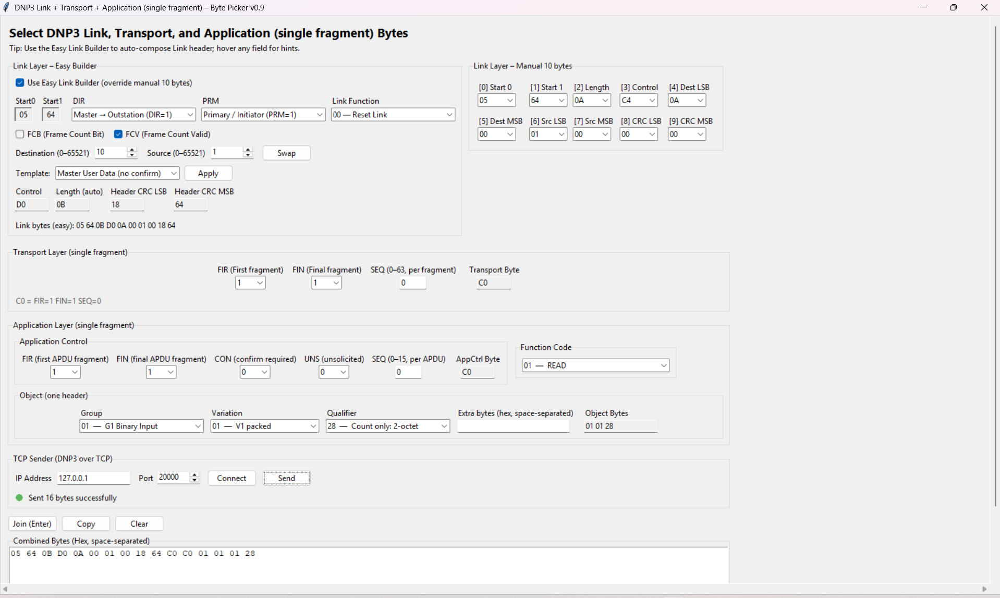

# DNP3 Packet Crafter

**DNP3 Packet Crafter** is a Python-based GUI tool for crafting and sending custom DNP3 protocol packets over TCP/IP to a DNP3 server (outstation). This application is designed for industrial control system (ICS) and SCADA researchers, students, and professionals to aid in learning, testing, and analyzing the DNP3 protocol in a controlled environment. By using this tool, users can construct arbitrary DNP3 messages (Link, Transport, and Application layers) and send them to a target server to observe and study the behavior of SCADA systems under various conditions.

## Features

- **Custom Packet Construction:** Build DNP3 packets by specifying custom values for Link-layer fields (start bytes, length, control flags, source/destination addresses, CRC, etc.) and Application-layer fields (function codes, object group/variation, qualifiers, and data).
- **Graphical User Interface:** Intuitive Tkinter-based GUI with form inputs and dropdowns for common DNP3 fields. It includes preset options for common function codes and data object identifiers, making it easier to craft valid packets.
- **TCP/IP Transmission:** Send crafted packets over a TCP/IP network to a designated DNP3 outstation (server). The default port is **20000** (the standard DNP3 TCP port), but users can specify any port.
- **Live Feedback:** Status messages in the GUI indicate the current target IP and port, and any send/receive actions. (For example, the tool will confirm when a packet is sent and may display basic response info if a reply is received.)
- **Extensibility:** The project structure allows for future expansion, such as adding more complex packet templates or automated test cases. A `templates/` directory is provided to store and load predefined packet configurations, and a `tests/` directory is prepared for adding unit tests.

## Installation & Setup

This tool requires **Python 3.x**. All primary dependencies (e.g., `tkinter`, `socket`, `threading`) are part of the Python standard library. No external Python packages are necessary.

However, ensure that Tkinter (the GUI toolkit) is installed and working on your system:

- **Linux:** On many distributions, you may need to install the Tkinter module separately. For Debian/Ubuntu, run `sudo apt-get install python3-tk` to install Tkinter. Make sure to have Python 3 and pip installed (e.g., via `sudo apt-get install python3 python3-pip`).
- **Windows:** The standard Python installer for Windows includes Tkinter by default. Simply ensure that Python 3 is installed. You can download it from the official Python website if not already installed.

**Installation Steps:**

1. **Clone the Repository:**  
   Clone the project repository from GitHub:  
    ````bash
    git clone https://github.com/Rajeshawal/DNP3-Packet-Crafter.git
    cd DNP3-Packet-Crafter
    ````

2. **Install Dependencies:**  
   Install required dependencies using pip (although standard library modules are used, this ensures any environment specifics are handled). 

   *Note:* If `tkinter` is not available in your Python environment, refer to the OS-specific instructions above to install/enable it.

3. **Run the Application:**  
   Launch the DNP3 Packet Crafter GUI by running the main script:  
    ````bash
    python3 -m DNP3PacketCrafter.py
    ````  
   Or on Windows, you may double-click the `main.py` (or run it via `python` from the command prompt).

After these steps, the GUI window for DNP3 Packet Crafter should open.

## Usage Overview

Using DNP3 Packet Crafter is straightforward:

- **Target Configuration:** In the GUI, enter the target DNP3 outstation's IP address and port. Ensure you have permission to send packets to this server and that it is expecting DNP3 over TCP. The default DNP3 TCP port is 20000, but you can adjust it as needed.
- **Crafting the Packet:** Use the provided fields and dropdown menus to construct your packet:
  - Set Link Layer parameters: e.g., frame length, control bits (such as DIR, PRM, FCV/FCB bits), destination and source addresses. The tool will automatically calculate the CRC for the link layer.
  - Set Application Layer parameters: choose a function code (e.g., Read, Write, Select, Operate, etc.) from the dropdown and specify object group/variation and qualifiers if applicable. You can also enter raw hex data for the payload if needed.
- **Sending the Packet:** Once your packet fields are set, click the **Send** button. The tool will establish a TCP connection to the specified server and transmit the crafted DNP3 packet.
- **Monitoring Response:** If the outstation responds, the tool will display the raw response (in hex) or any status message in the GUI's status area. This allows you to observe how the server reacts to the custom packet.
- **Iterative Testing:** Feel free to modify fields and send multiple packets. This helps in testing different scenarios (e.g., sending a malformed packet vs. a valid control command) to study the outstation's behavior.

*Figure: Screenshot of the DNP3 Packet Crafter GUI showing fields for constructing a packet and the send action.* (Replace `assets/screenshot.png` with an actual screenshot of the tool in use.)



## Applications in ICS/SCADA Research

**DNP3 (Distributed Network Protocol)** is widely used in electric power systems and other industrial control systems as a communication protocol between SCADA masters and remote outstation devices (RTUs, PLCs, IEDs, etc.). This tool contributes to ICS/SCADA security and protocol analysis in several ways:

- **Educational Use:** Students and engineers can interactively learn how DNP3 packets are structured. By tweaking packet fields and observing outcomes, users gain a deeper understanding of the protocol’s mechanics (such as how function codes and object values affect device behavior).
- **Protocol Analysis:** Researchers can craft unusual or edge-case packets to observe how a DNP3 implementation responds. This can reveal how robust an outstation is to malformed input or help in reverse-engineering and documenting protocol features.
- **Security Testing:** Security professionals can simulate malicious or unexpected DNP3 traffic in a controlled lab environment. For example, you can create packets to test for known vulnerabilities or to see if the outstation properly handles invalid data without crashing. This tool can be a lightweight alternative to full-fledged packet injection frameworks when focusing specifically on DNP3.
- **Experimentation with Templates:** Using the provided `templates/` directory, users can save and load predefined packet configurations (e.g., a typical "Read" request or a "Freeze Counter" command). This makes it easy to repeat tests and share scenarios with colleagues. As the project grows, we plan to include more built-in templates for common DNP3 messages.

**Important:** Always use this tool in a safe and controlled environment (such as a lab network or with devices you have permission to test). Sending crafted DNP3 packets to real-world systems without authorization can disrupt critical operations and is likely illegal.

## Contribution Guidelines

Contributions to DNP3 Packet Crafter are welcome! If you have ideas for improvements or new features (such as additional protocol support, improved UI, or automated analysis tools), feel free to contribute.

**How to Contribute:**

- **Bug Reports & Feature Requests:** If you encounter a bug or have a suggestion, please open an issue on GitHub. Provide as much detail as possible (environment, what you were doing, error messages, etc.).
- **Pull Requests:** Fork the repository and create a new branch for your changes. When ready, submit a pull request. Ensure your code follows a consistent style (PEP 8 for Python) and include relevant comments or documentation for any complex logic.
- **Coding Standards:** Try to follow the structure and patterns used in the project. For instance, keep GUI-related code modular (e.g., in the `gui.py` module) and any protocol-specific logic separated (e.g., a `dnp3_logic.py`). This separation makes it easier to maintain and extend. Add unit tests in the `tests/` directory for any new core functionality whenever feasible.
- **Discussion:** For major changes, it’s best to discuss your plan in an issue first to ensure alignment with the project goals and to avoid duplicate work. We're open to enhancements that make the tool more useful for the community.

By contributing, you agree that your contributions will be licensed under the same MIT License that covers this project.

## Disclaimer

This tool is intended **for educational and authorized testing purposes only**. DNP3 Packet Crafter should only be used on networks and devices for which you have explicit permission. The authors and contributors of this project are **not responsible** for any misuse or damage caused by this software.

DNP3 is often used in critical infrastructure; sending unintended or malformed packets to operational systems can cause outages or safety issues. **Always test in a controlled environment** (for example, a test lab or simulation with no impact on real equipment). Be mindful of all applicable laws and regulations. Using this tool for malicious or unauthorized purposes is strictly prohibited.

## License

This project is licensed under the [MIT License](LICENSE). You are free to use, modify, and distribute this software. See the `LICENSE` file for details.
